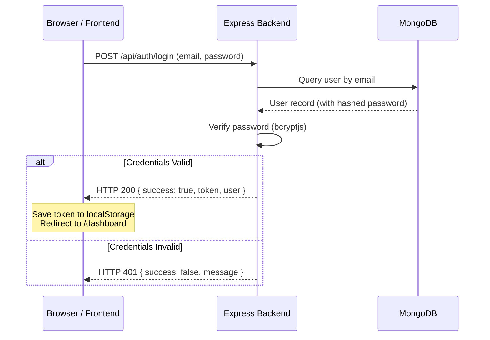

# EMS Hub Login & Authentication Documentation

This document describes the design, security architecture, and routing protocols of the authentication system within the **Employee Management System (EMS Hub)**.

---

## 🔑 Authentication Architecture

The system uses **JSON Web Tokens (JWT)** for stateless, secure authentication across the frontend and backend.



---

## 👥 Seed User Credentials

On first boot, if the database is empty, it automatically seeds default accounts. These accounts can be populated instantly on the login screen using the **Quick Fill** badge buttons:

| Identity Role | Email / Username | Default Password | Linked Record | Access Permissions |
| :--- | :--- | :--- | :--- | :--- |
| **System Admin** | `admin@ems.com` / `admin` | `admin123` | *None* | Full access to System Settings, Audit Logs, Users, and Roles |
| **HR Manager** | `hr@ems.com` / `sarah.jenkins` | `hr1234` | Sarah Jenkins (`EMP100`) | Access to Directory, Leaves, Attendance, and Recruitment |
| **Employee** | `employee@ems.com` / `john.doe` | `emp1234` | John Doe (`EMP101`) | Restricted access to personal Profile, Leaves, Attendance |

---

## 🌐 API Specifications

### 1. User Sign In
* **Endpoint:** `POST /api/auth/login`
* **Access:** Public
* **Request Body:**
  ```json
  {
    "email": "admin@ems.com",
    "password": "admin123"
  }
  ```
* **Success Response (200 OK):**
  ```json
  {
    "success": true,
    "token": "eyJhbGciOiJIUzI1NiIsInR5cCI6IkpXVCJ9...",
    "user": {
      "_id": "60c72b2f9b1d8b2a3c8d4567",
      "username": "admin",
      "email": "admin@ems.com",
      "role": "admin"
    }
  }
  ```

### 2. Verify Session
* **Endpoint:** `GET /api/auth/me`
* **Access:** Private (Requires `Authorization: Bearer <token>` header)
* **Success Response (200 OK):**
  ```json
  {
    "success": true,
    "user": {
      "_id": "60c72b2f9b1d8b2a3c8d4567",
      "username": "admin",
      "email": "admin@ems.com",
      "role": "admin",
      "employee": null
    }
  }
  ```

---

## 🎨 Frontend Implementation

### Component Structure
1. **[Login.jsx](file:///d:/New%20folder/Employee%20Management%20System/frontend/src/pages/Login.jsx)**: Handles form input, input validation, errors, and rendering of the premium dark glassmorphic card.
2. **[AuthContext.jsx](file:///d:/New%20folder/Employee%20Management%20System/frontend/src/context/AuthContext.jsx)**: Manages global authentication state (`user`, `loading`), checks the `localStorage` token on mount, and exposes the `login` and `logout` actions.
3. **[api.js](file:///d:/New%20folder/Employee%20Management%20System/frontend/src/utils/api.js)**: Configures the base HTTP fetch wrapper, setting the headers and clearing expired sessions dynamically if a `401 Unauthorized` status is received.

### Premium UI Specifications
* **Backdrop Blur:** Glassmorphism card created via `backdrop-filter: blur(30px)` and semi-translucent colors (`rgba(15, 23, 42, 0.45)`).
* **Typography:** Integrates **Outfit** for headers/metrics and **Plus Jakarta Sans** for body/labels.
* **Glow Effects:** Input focus applies a violet drop shadow: `box-shadow: 0 0 15px rgba(103,119,239,0.2)`.
* **Particle Canvas:** Lightweight `<canvas>` script rendering 60 floating nodes with connecting lines, creating a tech-oriented visual background.

---

## 🛠️ Troubleshooting Connection Issues

> [!IMPORTANT]
> **Windows Loopback Resolution Bug:**
> In Windows, browsers resolve `localhost` queries to IPv6 (`::1`) first. If Node has bound the listener exclusively to IPv4 (`127.0.0.1`), this causes browser fetch requests to throw a `Failed to fetch` connection drop error.
> 
> **Resolution:**
> Set the frontend API endpoint (`BASE_URL`) to use `127.0.0.1` explicitly rather than `localhost`:
> * Correct: `const BASE_URL = 'http://127.0.0.1:5000/api';`
> * Affected files: [api.js](file:///d:/New%20folder/Employee%20Management%20System/frontend/src/utils/api.js#L1) and [useRealtimeNotifications.js](file:///d:/New%20folder/Employee%20Management%20System/frontend/src/hooks/useRealtimeNotifications.js#L3)
