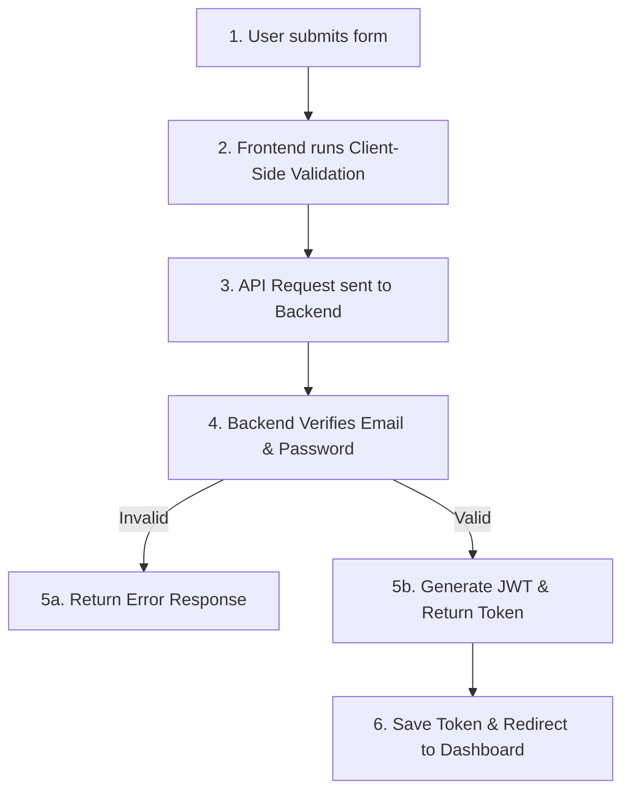

# 📝 Step-by-Step Login Guide (Login Steps Notes)

This document breaks down the login process into simple, sequential steps—covering both the **User Steps** (how to use the interface) and **System Steps** (what happens under the hood).

---

## 🧑‍💻 Part 1: User Actions (Step-by-Step)

### **Step 1: Open the Application**
Navigate to the login page in your browser:
👉 [http://localhost:5173/login](http://localhost:5173/login)

### **Step 2: Choose Authentication Method**
You can log in in one of two ways:
* **Option A (Manual Entry):** Type your registered email address and password in the input fields.
* **Option B (Quick-Fill Badges):** Click on one of the role badges at the top (**Admin**, **HR**, or **Employee**) to automatically populate the demo credentials.

### **Step 3: Toggle Password Visibility (Optional)**
Click the eye icon (`👁️` / `👁️‍🗨️`) in the password field to show or hide the password characters.

### **Step 4: Check "Keep me signed in" (Optional)**
Select this checkbox to retain your login session even after closing the browser tab.

### **Step 5: Submit the Form**
Click the **Sign In** button. 
* The button will show a loading spinner with the text *"Authenticating..."*.
* If authentication succeeds, you will be automatically redirected to the **Dashboard**.
* If authentication fails, a red warning box will display the error (e.g., *Invalid credentials* or *Connection to auth server failed*).

---

## ⚙️ Part 2: System & Code Flow (Under the Hood)

When you click **Sign In**, the application performs the following steps sequentially:



### **Step 1: Client-Side Check**
The frontend checks if both the email and password fields are filled out. If any field is empty, it halts the process and shows an alert.

### **Step 2: API Call Triggered**
The React client sends a `POST` request to:
`http://127.0.0.1:5000/api/auth/login` containing the credentials in the request body.

### **Step 3: Database Query**
The Express backend receives the request and queries the MongoDB database for a user matching the provided email:
```javascript
const user = await User.findOne({ email });
```

### **Step 4: Hashed Password Verification**
If the user exists, the backend compares the typed password against the hashed password stored in the database using `bcryptjs`:
```javascript
const isMatch = await bcrypt.compare(password, user.password);
```

### **Step 5: Token Generation**
If the passwords match, the backend generates a secure **JWT token** containing the user ID and signs it with the server's `JWT_SECRET`:
```javascript
const token = jwt.sign({ id: user._id }, process.env.JWT_SECRET, { expiresIn: '30d' });
```
It returns an HTTP `200` response containing this token and user metadata.

### **Step 6: Session Initialization**
The frontend catches the successful response:
1. Stores the JWT token in the browser's storage: `localStorage.setItem('ems_token', data.token);`
2. Updates the global `user` context state in `AuthContext.jsx`.
3. Triggers `react-router-dom` to navigate the user to `/dashboard`.
